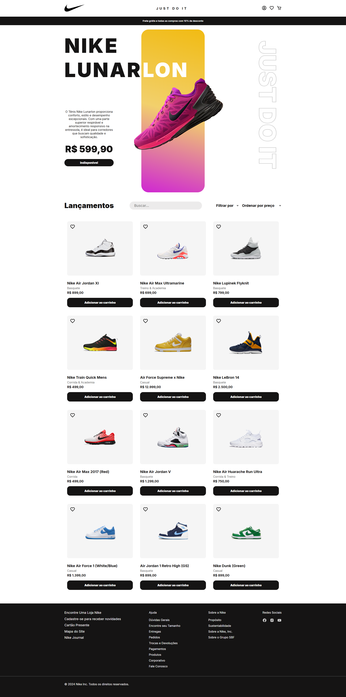

<h1 align="center">
  Nike Inspired Site
</h1>

Nike Inspired Site é um site de compras inspirado no site da **Nike**. Permite aos usuários adicionar itens ao carrinho e favoritos, oferece filtros de produtos e integração com uma API para listagem e gerenciamento de produtos.

<p align="center">
  
</p>

## 💻 Visão Geral

Nike Inspired Site é uma aplicação web para compras online, permitindo aos usuários adicionar itens ao carrinho, adicionar aos favoritos, aplicar filtros de produtos e muito mais. O site integra-se a uma API para gerenciar os itens disponíveis.

## ⚙️ Funcionalidades

- Adicionar itens ao carrinho de compras.
- Adicionar itens aos favoritos para referência futura.
- Aplicar filtros para encontrar produtos por tipo e ordenar por preço.
- Exibir lançamentos de produtos com opções de filtragem e ordenação.
- Integração com API para buscar e gerenciar itens disponíveis.
- Interface responsiva e adaptável para diferentes tamanhos de tela.

### Listagem de Produtos e Lançamentos

O componente `Releases.vue` é responsável por exibir os lançamentos de produtos e oferecer funcionalidades avançadas de filtragem e ordenação:

- **Fetch de Produtos Dinâmico**: Utiliza `axios` para buscar produtos da API, aplicando filtros como título, tipo e ordenação por preço.
- **Filtros Interativos**: Permite aos usuários filtrar os produtos por tipo (Basquete, Corrida, Casual, Treino, Academia) e ordená-los por preço.
- **Manipulação de Carrinho**: Integra-se ao estado global de carrinho (`cart`), permitindo adicionar e remover itens dinamicamente com feedback visual imediato.

### Implementação

O código em `Releases.vue` utiliza Vue.js e suas capacidades reativas para fornecer uma experiência interativa e responsiva de compra online, adaptando-se dinamicamente a mudanças nos filtros e na interação do usuário.

## 🛠️ Tecnologias

Aqui estão as principais tecnologias utilizadas neste projeto:

- **Vue.js:** Framework JavaScript para construção de interfaces de usuário.
- **Vue Router:** Roteamento para aplicações Vue.js.
- **Axios:** Cliente HTTP baseado em Promise para fazer requisições AJAX.
- **Pinia:** Gerenciamento de estado para aplicações Vue.js.

<br>

# 🛠️ Instalação

### Requisitos

- Node.js (versão 14 ou superior)
- npm (versão 6 ou superior)

### Passos

1. **Clone o repositório:**

```sh
git clone https://github.com/RodrigoRodrigues-Dev/nike-inspired-site.git

cd nike-inspired-site
```

2. **Instale as dependências:**

```sh
npm install
```
<br>

# 🚀 Uso
Para iniciar a aplicação em modo de desenvolvimento, execute:


```sh
npm run dev
```
Para construir o projeto para produção, utilize:
```sh
npm run build
```

## 📃 Licença
Este projeto está licenciado sob a Licença MIT - veja o arquivo [LICENSE](LICENSE) para mais detalhes.

## ☎️ Contato
Desenvolvido por [Rodrigo Rodrigues](https://github.com/RodrigoRodrigues-Dev). Entre em contato por 📧 [rodrigorodriguesdevcontato@gmail.com](mailto:rodrigorodriguesdevcontato@gmail.com) 